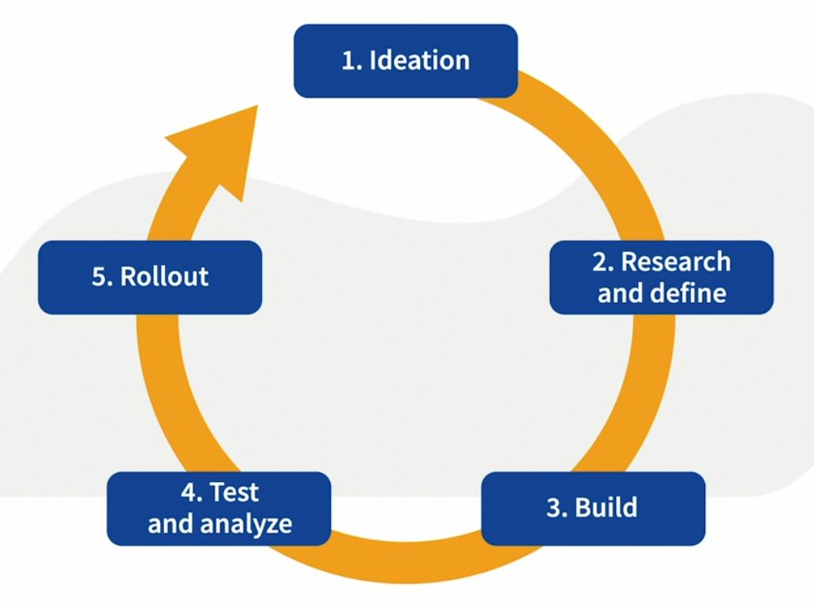

# IT_ProductManagement

What kind of person fits into a technical product management role?
It is someone who is passionate about technologies, enjoys problem-solving, always thinking of new digital products or ways to improve existing ones.

## Technical Product Management
### Product Manager
  1. A PM helps their team build and ship the right product.
  2. A PM answers what the team should build and why.

### Some questions a PM will need to answer
  1. What is the strategy in your roadmap?
  2. How will you find a market fit for your solutions?
  3. Is it the right time, or even the right problem to solve?

Once these questions are answered, the Project or Program manager will focus on the execution and handling of how. By breaking your PM roadmap down into small, short-term pieces.

## The Digital Product Life Cycle
What are the different stages of a product life cycle?
And what is your job as a technical product manager throughout them?

### Ideation
Be ahead of your time and find gaps in your market and fill the pain points of your users.

This can be done by brainstorming with other team members, listening to users, and reviewing the competition.

### Research and Define
Once you have a general idea, and an area of focus, this stage will help you define your problem scope.

Who are your users? Who are you solving for? What are their goals, aspirations, pain points, and use cases?

### Build
Come up with a minimum viable product for what you want to achieve.

1. Minimum working version of a product
2. Maximum learning

### Test and Analyze
Allow your team to test your product before it's available to the public.

### Rollout
If you get negative results from testing, you can reiterate and pivot the direction of the product.

